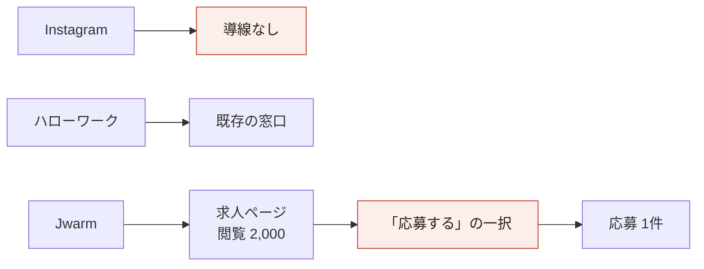
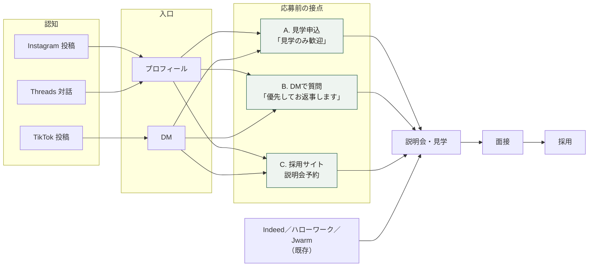

# 応募導線ラフ

採用SNS簡易調査 納品物2
沖縄介護センター様 ／ 2026年8月

「閲覧はあるのに応募がない」段差を埋める、導線の設計図です。実装とサイト制作は本契約に含みません（必要な場合は別途お見積り）。

---

## 1. いまの導線と問題

- 入口が「応募する」の一択で、迷っている人・比較中の人の受け皿がない
- 介護の求人投稿はコメント0が多く、見て終わりになっている（沖縄の同業2社も同様）
- 採用しても1日で辞めるケースがある。応募前に互いを知る場がないまま選考に入っている

## 2. 設計の考え方

1. **応募の手前に軽い段階を置く** ——「見学のみ歓迎」「話を聞くだけOK」「DMで質問OK」。沖縄・長野・大阪の3法人が独立に実施していた
2. **SNS経由を優先選考にする** ——「SNS応募 優先選考」（大阪・訪問看護おかあさんの実例）。応募の動機になり、どの入口から来たかも見分けられる
3. **迷いに答える数字を置く** —— 人員配置比・手当表など、応募判断に必要な情報を応募前に渡す
4. **受け皿を決めてから出す** —— 誰がいつ返すかを決めずに窓口だけ増やすと、放置が起きて逆効果になる

## 3. あるべき導線

A・B・Cはいずれも応募の「代わり」ではなく「手前」です。2,000人の閲覧の中にいたはずの「気になるが決めきれない」層を、まずここで受けます。正式な応募（履歴書の提出）は、説明会や面接で互いを知ったあとに来る形にします。

## 4. 媒体別に置くもの

採用チャネル全体では **採用サイト → Indeed → SNS（補完）** の順に力を入れます（8月17日のお打ち合わせで合意）。以下はSNSの中での配分です。Indeed・ハローワーク・Jwarmは既存の応募窓口として続け、リンク先を新しい採用サイトに向けます。

**Instagram（主戦場・既存 @okinawakaigo）**

- プロフィールに3点: ①所在地「沖縄・那覇」 ②「見学だけでも歓迎」 ③「SNSからのご連絡は優先してお返事します」
- ハイライトに「職員紹介」「募集要項」「見学の流れ」を常設し、連載を流れて消えない資産にする
- 所在地を書く理由: 地域ハッシュタグは地理フィルタとして機能しないため

**TikTok（第2の柱・新設を提案）**

- 「気になる方はDMまで」だけで始められる。リンクやページの整備を待たない（鹿児島・旭生会の実例）
- 投稿の位置情報に事業所名・地域を付ける

**Threads（応募前の接点・制作費ゼロ）**

- 告知ではなく対話の場。問いかけ → 返信の中で条件確認 → DMへ
- 始める前に、給与・シフトの質問に公開の場でどこまで答えるかを決める

**Facebook（競合の条件を知る情報源。投稿は必須にしない）**

- 投稿するなら、沖縄の同業と同じく給与月額と見学歓迎の一文を本文に。電話番号だけの導線にせず、メッセージ受付を併記する

## 5. 3つの接点の仕様

### A. 見学申込 —— いちばん軽い入口

| | |
|---|---|
| 文言 | 「見学のみでも歓迎です。まずは話だけ聞いてみたい、でOK」 |
| 受け方 | DM。採用ページ整備後は申込フォーム（電話でも受けるかは §6 で決めます） |
| ねらい | 「1日で辞める」ミスマッチを選考前に減らす。職場の雰囲気という最大の武器を見せる場 |

訪問介護には見学先の施設がありません。**何を見せるかを先に決めます**（事務所での面談、サービス提供責任者への同行など）。ご利用者宅は対象外です。

### B. DMで質問 —— 迷っている人の窓口

| | |
|---|---|
| 文言 | 「SNSからのご連絡は優先してお返事します」「SNS応募 優先選考」 |
| 受け方 | Instagram DM・TikTok DM |
| ねらい | 1件の回答が他の検討者にも届く。回答範囲は事前に決める（→ §6） |

### C. 採用サイト → 説明会予約 —— 決めかけている人の入口

自社の採用サイトを本命の受け皿にします。ゴールは「応募」ではなく**説明会予約**です。求人ページは2,000閲覧に対し応募1件でしたが、会社説明会には26名が参加しました。応募より手前の説明会のほうが、入口として機能しています。

要件は次のとおり（制作は本契約外。詳細は納品物4「採用サイトラフ」）。

- スマホ前提。プロフィールから3タップ以内で予約フォームに到達
- 給与レンジ・手当表・人員配置比など、裏づけられる数字を出す
- SNSの職員紹介連載をそのまま掲載する枠
- 予約フォームは項目を最小限に（氏名・連絡先・希望職種・きっかけ・希望する次のステップ）
- 「希望する次のステップ」で説明会／見学／すぐに面接、を選べるようにする。すぐ応募したい人の出口も確保する
- 「きっかけ」の選択肢に「Instagram」「知人・紹介」などを入れる（計測につなぐ）
- 履歴書などの個人情報はサイトでは受けない

## 6. 受け皿の運用ルール

窓口を増やす前に、誰がいつまでに、どこまで答えるかを決めます。**対応はすべて又吉様が担当します。**

| 接点 | 担当者 | 返答期限 | 回答してよい範囲 |
|---|---|---|---|
| Instagram DM | 又吉様 | 例: 翌営業日 | |
| TikTok DM | 又吉様 | | |
| 公開コメント | 又吉様 | | 給与・シフトは「DMで詳しく」へ誘導 |
| 見学申込 | 又吉様 | | 見学の所要時間・流れのテンプレを用意 |
| 電話（既存） | 又吉様（既存運用） | | |

## 7. 計測につなぐ

この導線は、入口ごとに件数を数えられるように作ってあります。

- 数えるもの: 見学申込数／DM件数（媒体別）／説明会予約数
- SNS経由の見分け方: 「SNS応募 優先選考」の申告、フォームの「きっかけ」項目、リンクの計測パラメータ
- 今後は「閲覧 → 予約 → 説明会 → 見学 → 面接 → 採用」の段ごとに数える

詳しくは納品物3「簡易計測設計書」へ。

## 8. 参考事例 —— わくわくの森（ベストライフ沖縄）

お打ち合わせで挙がった参考事例を分析しました。要点は3つです。

1. 「応募する」ボタンを置かず、説明会申込を唯一の入口にしている
2. 5事業×全職種の給与レンジを資格別に全公開している
3. フォームに「求人を知ったきっかけ」の必須項目があり、入口別に計測している

導線は無料の静的ページと外部フォームで作られており、低コストで再現できます。弱点はSNSへの回遊がないことと「見学」の段階がないこと。貴社は本設計のA（見学）とSNS発信を足せば、同じ構造の上位互換になります。

---

お問い合わせ: 宮崎（hi@junabel.com）
