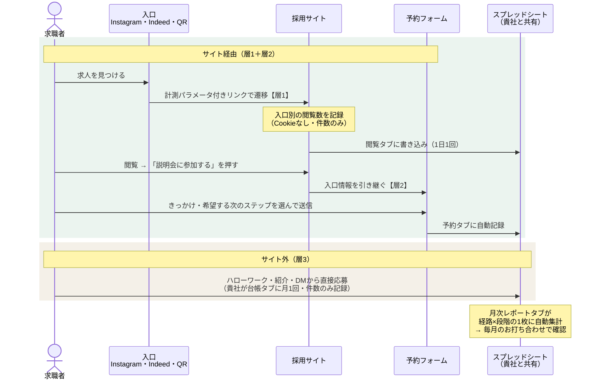

# 簡易計測設計書

採用SNS簡易調査 納品物3
沖縄介護センター様 ／ 2026年8月

「どの入口から来た人が、説明会予約・面接・採用まで進んだか」を数える仕組みの設計図です。実装と継続運用は本契約に含みません。

原則: 扱うのは個人を識別しない件数だけです。応募者個人の情報は貴社だけが持ちます。

---

## 1. 出発点

2026年8月時点の応募経路です。ここからの変化を測ります。

| 経路 | 実績 |
|---|---|
| Jwarm（求人サイト） | 閲覧2,000に対し応募1名 |
| 知人・紹介 | 応募1名 |
| ハローワーク | 応募1名 |
| 自社サイト・SNS | 0（これから作る経路） |

サイト・SNS経由の応募が1件でも入れば、純増として説明できます。

## 2. 3層で数える

リンクの計測だけでは「リンクを踏んだ人」までしか分かりません。説明会予約が経路別に数えられず、サイトを通らない応募（ハローワーク・紹介）も拾えません。そこで3層に分けます。

| 層 | 何をするか | 何が分かるか |
|---|---|---|
| 1 | リンクに計測パラメータを付ける | どの入口からサイトに来たか |
| 2 | 予約フォームで「きっかけ」を聞き、入口情報を引き継ぐ | どの経路の人が予約したか |
| 3 | サイト外の応募を月1回、件数だけ記録する | ハローワーク・紹介・DMからの応募 |

データの流れは次のとおりです。

## 3. 層1 —— リンクの計測パラメータ

採用サイトへのリンクすべてに、入口を示すパラメータ（URLの末尾に付ける目印。「utm」と呼ばれる標準的な形式）を付けます。表以外の値は使いません（表記がゆれると集計が割れるため）。

| 貼る場所 | 付けるパラメータ |
|---|---|
| Instagram プロフィール | `?utm_source=instagram&utm_medium=bio` |
| Instagram ハイライト | `?utm_source=instagram&utm_medium=highlight` |
| Instagram 投稿・DM | `?utm_source=instagram&utm_medium=post` |
| Indeed 求人 | `?utm_source=indeed&utm_medium=listing` |
| Jwarm 求人（設定できれば） | `?utm_source=jwarm&utm_medium=listing` |
| 現サイトのトップ | `?utm_source=corp&utm_medium=link` |
| 説明会・配布物のQR | `?utm_source=qr&utm_medium=print` |

リンク一覧は宮崎が発行し、各媒体への設定をお願いします。

## 4. 層2 —— 予約フォーム

Googleフォームの項目です。項目は最小限にします。

| 項目 | 形式 | 内容 |
|---|---|---|
| 氏名・連絡先 | 記入 | 連絡用。集計には使わない |
| 希望職種 | 選択 | ヘルパー／ケアマネ／相談員／その他 |
| 希望する次のステップ | 選択 | 説明会に参加したい／見学したい／すぐに面接を希望する |
| きっかけ | 選択・必須 | Instagram／Indeed／ハローワーク／Jwarm／知人・紹介／検索／その他 |
| 流入元 | 自動入力 | サイトのボタンが入口情報を自動で埋める。回答者は触らない |

「きっかけ」と「流入元」は別物として両方持ちます。Instagramで知って後日検索から来た人は、きっかけ＝Instagram・流入元＝検索になります。認知に効いた媒体と、直前の入口を分けて見られます。

月次レポートの「閲覧 → 予約 → …」の列は**流入元**で通します。閲覧と同じキーで数えないと、閲覧→予約の比率が別々の母集団の割り算になるためです。「きっかけ」は認知に効いた媒体を見る別表に使います。

## 5. 閲覧数の数え方 —— 自前の軽量計測

Google Analytics（GA4）は使わず、サイトに軽い計測を自前で組み込みます。

理由:

- この設計で閲覧数に求めるのは「入口別の内訳」だけで、GA4の多機能は必要ない
- 想定規模（月数十〜数百アクセス）に対して運用が重い
- Cookieを使わずに作れるため、同意バナーが不要で「件数だけ」の原則と一致する

仕組み: ページ表示時に日付・入口・ページだけを記録し、1日1回まとめてスプレッドシート（§7）に書き込みます。IPアドレス・端末情報・Cookieは保存しません。

限界: 厳密なbot除外はしません。数字は絶対値の精密さより、経路間の比較と月ごとの傾向を見るために使います。GA4は後からでも追加できます。

Indeed・Jwarm・ハローワークの閲覧・応募数は、各媒体の管理画面の数字を使います。

## 6. 層3 —— 月次台帳

サイトを通らない応募（InstagramのDM・電話・ハローワーク・紹介）と、面接・採用の実績を拾います。月1回、件数だけをスプレッドシート（§7）に記録します（所要5分）。

記録の形は「1行＝1か月×1入口」。入口ごとに、どの段階まで進んだかを左から右へ数えます。列の形はどの行も同じです。具体的な列とサンプルは§7の「台帳」タブに示します。

## 7. レポート —— 1つのスプレッドシートに集約

計測の置き場所は、貴社と共有する**Googleスプレッドシート1つ**です。自動で入る数字と手入力の台帳を同じファイルにまとめ、月次の表はそこから自動で組み上がります。

| タブ | 中身 | 更新 |
|---|---|---|
| 月次レポート | 経路×段階の1枚の表。他のタブを参照する計算式のみ | 自動 |
| 閲覧 | 日付×入口×ページの件数。サイトの計測から書き込み | 自動・1日1回 |
| 予約 | 予約フォームの回答。Googleフォームの回答先に指定するだけ | 自動・即時 |
| 台帳 | サイト外の応募・面接・採用の件数 | 貴社・月1回 |

以下、各タブの列とサンプル行です。**台帳の2026-08行だけが貴社の実際の数字**（確定していないセルは空欄）で、それ以外はすべて説明用の架空の値です。

### タブ「閲覧」（自動・1日1回）

1行＝1日×1入口×1ページの件数。サイトの計測が毎朝、前日分を追記します。

| 日付 | 入口（utm_source） | 枠（utm_medium） | ページ | 閲覧数 |
|---|---|---|---|---|
| 2026-09-01 | instagram | bio | / | 12 |
| 2026-09-01 | instagram | bio | /#reserve | 4 |
| 2026-09-01 | indeed | listing | / | 7 |
| 2026-09-01 | (なし) | (なし) | / | 5 |
| 2026-09-02 | instagram | bio | / | 9 |
| 2026-09-02 | qr | print | / | 2 |

- 「(なし)」は計測パラメータのない流入（検索・直接アクセス）
- 「/#reserve」は予約ボタン部分まで到達した回数。到達数があれば「読んだのに予約しない」かどうかが分かる

### タブ「予約」（自動・即時）

1行＝フォーム1回答。Googleフォームが自動で追記します。氏名・連絡先の列は貴社だけが見る前提で、集計には使いません。

| 送信日時 | 氏名 | 連絡先 | 希望職種 | 希望する次のステップ | きっかけ | 流入元（自動） |
|---|---|---|---|---|---|---|
| 2026-09-03 10:12 | （非表示） | （非表示） | ヘルパー | 説明会に参加したい | Instagram | instagram |
| 2026-09-05 21:40 | （非表示） | （非表示） | ケアマネ | すぐに面接を希望する | ハローワーク | (なし) |
| 2026-09-08 14:05 | （非表示） | （非表示） | ヘルパー | 見学したい | 知人・紹介 | instagram |

- 3行目のように「きっかけ＝知人・紹介」「流入元＝instagram」が両方入ることがあります。紹介で知り、Instagramのリンクから予約した人です。両方持つ意味はここにあります

### タブ「台帳」（貴社・月1回）

1行＝1か月×1入口。§6の形そのままです。**予約フォームを通らない接触**（InstagramのDM・電話・紹介・求人サイト経由）と、説明会以降に進んだ人数を記録します。フォームからの予約は自動で数えるので、ここには書きません。

| 月 | 入口 | 応募・問合せ | 説明会 | 見学 | 面接 | 採用 |
|---|---|---|---|---|---|---|
| 2026-08 | ハローワーク | 1 | | | | |
| 2026-08 | 知人・紹介 | 1 | | | | |
| 2026-08 | Jwarm | 1 | | | | |
| 2026-08 | 会社説明会 | 26 | 26 | | | |
| 2026-09 | Instagram | 4 | 3 | 1 | 1 | 0 |
| 2026-09 | Indeed | 2 | 1 | 0 | 1 | 0 |
| 2026-09 | 検索・現サイト | — | 1 | 0 | 0 | 0 |
| 2026-09 | 知人・紹介 | 1 | 0 | 1 | 0 | 0 |

- 「応募・問合せ」は、**予約フォームを通らずに来た最初の接触**の件数。InstagramのDM・電話・紹介・求人サイト経由が入ります。フォームからの予約はここに入れません（二重に数えないため）。DMの受付がない入口は「—」
- 「会社説明会」の行は、説明会に直接来た方。サイト経由で予約して参加した方は、元の入口（Instagram等）の行に数える
- 空欄は「0」ではなく「まだ確定していない」です。2026-08の面接・採用は、応募3名のうち2名を採用の方向という段階で経路ごとの内訳が未確定のため空けています。見学も「数名が希望」までが分かっていることで、件数は未確定です。**8月24日のお打ち合わせで埋めます**
- 個人名・年齢は書かない

### タブ「月次レポート」（自動集計）

毎月のお打ち合わせで見るのは、この1枚だけです。上の3タブから計算式で組み上がります。行が入口、列が段階。**左から右へ「閲覧 → 問合せ／予約 → 説明会 → 見学 → 面接 → 採用」と進みます。**「問合せ」と「予約」は応募の手前に並ぶ2つの接点で、どちらを通っても次は説明会・見学です。

| 2026-09 | 閲覧 | 問合せ | 予約 | 説明会 | 見学 | 面接 | 採用 |
|---|---|---|---|---|---|---|---|
| Instagram | 142 | 4 | 5 | 3 | 1 | 1 | 0 |
| Indeed | 63 | 2 | 2 | 1 | 0 | 1 | 0 |
| 検索・現サイト | 38 | — | 1 | 1 | 0 | 0 | 0 |
| ハローワーク | — | 0 | — | 0 | 0 | 0 | 0 |
| Jwarm | 210 | 0 | — | 0 | 0 | 0 | 0 |
| 知人・紹介 | — | 1 | — | 0 | 1 | 0 | 0 |
| 会社説明会（直接） | — | 0 | — | 0 | 0 | 0 | 0 |
| **合計** | **453** | **7** | **8** | **5** | **2** | **2** | **0** |

各列の出どころ:

- 閲覧: Instagram・検索は「閲覧」タブの月合計。Indeed・Jwarmは管理画面の数字を手で1つ入れる。ハローワーク・紹介・会社説明会（直接）は閲覧の概念がないので「—」
- 問合せ: 「台帳」タブの応募・問合せ。予約フォームを通らずに来た接触で、**InstagramのDM**（納品物2のB「DMで質問」の件数）・電話・Indeed／ハローワーク経由の応募が入ります。受付のない入口は「—」
- 予約: 「予約」タブを**「流入元」**で数えた件数。閲覧と同じキーなので、閲覧→予約を同じ土俵で比べられます。サイトを通らない入口はフォームを経由しないので「—」
- 説明会〜採用: 「台帳」タブの同じ月・同じ入口の行
- 「会社説明会（直接）」は、サイトを通らず説明会に直接来た方の行。2026年8月の26名はここに入ります
- 「きっかけ」は上の表には入れず、認知に効いた媒体を見る別表として集計します

読み方の例（上のサンプルなら）:

- Instagramは閲覧142に対し予約5。比率はいちばん良いが、母数を増やせばまだ伸びる
- Jwarmは閲覧210で予約0。「見られているのに動かない」段差が続いている
- Instagramは予約5に加えてDM4件。**軽い接点を2つ置いたぶんだけ手前の接触が増えています**
- 説明会5・見学2・面接2。「説明会予約をゴールにする」設計が機能している

段ごとに数えるのは、どこを直せばいいかを特定するためです。Jwarmの「2,000閲覧・応募1名」は、この診断ができなかった実例でした。

**報告のルール**: 数字には定義と出所を必ず添えます（例: サイト閲覧＝計測タグの件数、応募・採用＝貴社の記録）。比率より絶対数を主にし、母数が小さい月に%だけで語りません。手転記はしません。

## 8. 役割分担

| 作業 | 担当 | 時期 |
|---|---|---|
| スプレッドシートのひな形作成・共有 | 宮崎 | サイト実装時 |
| 計測パラメータ付きリンクの発行 | 宮崎 | サイト公開時 |
| 各媒体へのリンク設定 | 貴社 | サイト公開時 |
| 予約フォーム・計測・シート書き込みの組み込み | 宮崎（実装のお見積りに含む） | サイト実装時 |
| 台帳タブの記録（5分/月） | 貴社 | 毎月末 |
| 月次レポートの読み合わせ | 宮崎・貴社 | 毎月 |

---

お問い合わせ: 宮崎（hi@junabel.com）
