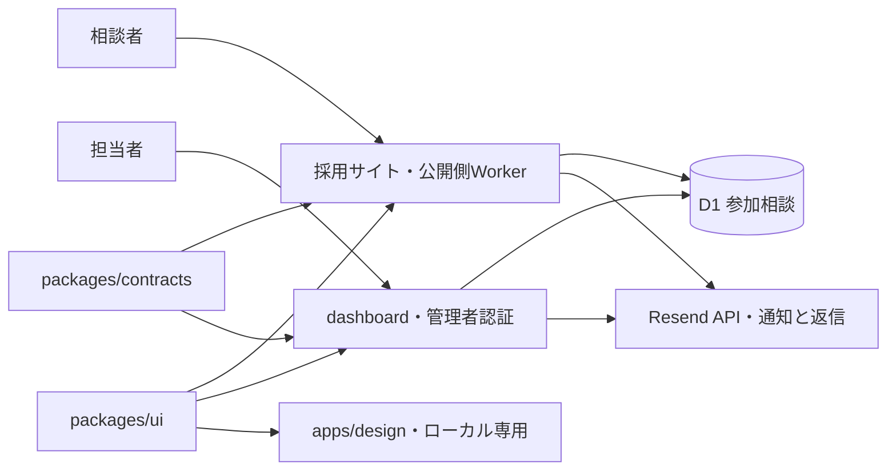
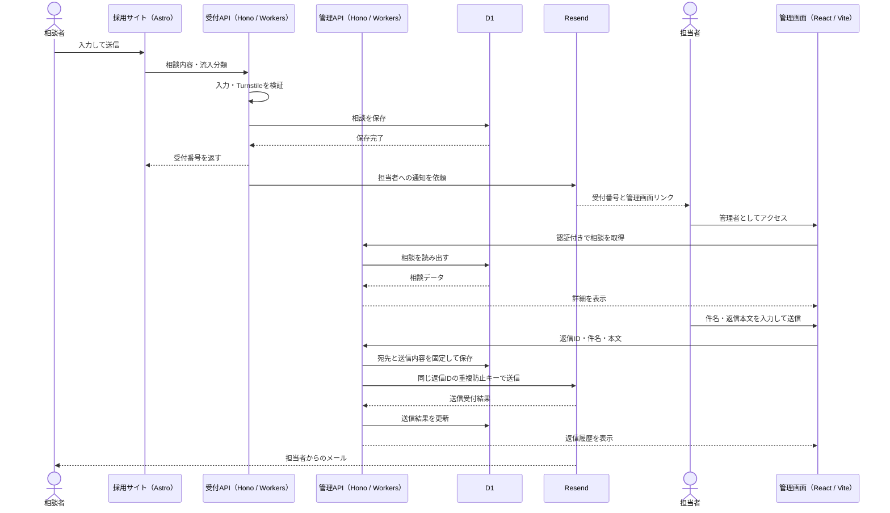

# 設計とデザインの判断

## 採用から全体刷新へ

実装基盤はCloudflare／TypeScript、採用サイトの公開先は `https://recruit.okinawakaigo.com/` です。制作確認中は共有ID・パスワードによるBasic認証とnoindexで限定公開します。過去の契約書や議事録は履歴として変更していません。

採用だけを独立したビジュアルにせず、「利用者の暮らしと働く人の暮らし、どちらも大切にする」を共通のブランド方針とします。採用の主導線は説明会への参加相談。過去の議事録にある30〜40代のフルタイム人材を主に想定しつつ、年齢による応募制限は表現しません。

## 実装構成

`apps/recruit` はAstroの静的コンテンツサイト、`apps/dashboard` はReact＋Viteの管理アプリです。`apps/api` にHonoを使った公開側・管理側のWorkerを置き、それぞれ必要なアプリの静的ファイルを配信します。旧 `edge` は不要なサービスを残したものではなく、配信・認証・APIの実装を担っていたため、責務が分かる `api` に改名しました。

採用サイトは `recruit.okinawakaigo.com`、管理画面は `dashboard.okinawakaigo.com`。APIは各画面と同じオリジンの `/api/` です。CORSやブラウザへの秘密鍵は不要です。全リクエストでWorkerが認証を先に実行し、管理側は専用の認証情報を使います。詳細と公開準備は [deployment.md](deployment.md) を参照してください。

共通デザインの実体は `packages/ui`、項目とAPIの型・検証は `packages/contracts`、会社の原稿と流入分類は `packages/content` に置きます。ガイドは `apps/design` で実際の共通部品を読み込み、ローカルでのみ確認します。公開サイトの `/design/` は削除し、ガイド用のデプロイ設定は作りません。

Astroは文章と写真を静的HTMLとして配信し、フォーム送信だけをTypeScriptで動かします。管理画面はReactで一覧・詳細・編集中の値を管理し、Viteでビルドします。APIのルーティングと認証・レスポンスヘッダーの適用にはHonoを使用します。pnpm workspaceで各アプリを分離し、Cloudflare Workers Static Assetsで配信します。

Tailwind CSS 4のテーマを `packages/ui/src/tokens.css` に置き、色・書体・文字サイズ・4px単位の余白・ブレークポイントを共有します。ボタン・選択欄・入力欄を共通部品にし、Stylelintで値の直接指定を検査します。[スタイルの統一ルール](styling.md) を参照してください。

## デザイン方針

| 要素 | 方針 |
| --- | --- |
| 色 | 深緑 `#136c60`、文字 `#203e3a`、白 `#ffffff`、葉の陰 `#edf5f1`、砂 `#f6f6f0`、陽だまり `#ecda8a` |
| 書体 | 大見出しはNoto Serif JP 500、本文とUIはNoto Sans JP、英字・電話番号はDM Sans。いずれも自己配信 |
| 配置 | 見出し・本文は左揃え。ヒーローは言葉と人の写真の2列、スマホは縦積み。募集職種は一覧性のある開閉式 |
| 写真 | ヒーローは大きな写真1枚と角丸。PCはコピーと縦長写真の2列、スマホは縦積み。会社の雰囲気は本文各所の写真でも伝える方針。沖縄の風景は地域とのつながりとして使用 |
| 操作 | CTAは深緑。角丸6px、基本高さ56px。本文を自動で隠すスクロール演出やスライドショーは使用しない |
| 言葉 | 働き方を保証する断言、架空の職員の声、未確認の給与・実績数値を載せない |

よくある福祉サイトの均等なカード群にせず、仕事は比較しやすい一覧、環境は3つの取り組み、相談は1つのパネルに役割を分けました。沖縄の観光だけが主役にならないよう、ヒーローには介護の場面を置いています。

ヒーローは静止画1枚を優先して読み込み、端末幅に応じたWebPを配信します。現在は `care.jpg` をイメージ写真と明示して使用。実写を受領したら主写真を差し替え、本文各所でも会社の雰囲気が伝わる配置を整えます。撮影参考画像と撮影意図は `apps/recruit/src/content/photography-brief.ts` にまとめ、`/photo-brief/` で確認できます。

## 参加相談と計測

専用フォームはD1に直接保存し、Googleフォーム・Sheets APIには接続しません。氏名・メールアドレス・気になっている仕事・同意を必須、年齢層・性別・都合のよい日時・聞きたいことを任意にします。送信だけで参加日程は確定せず、担当者がメールで調整します。

流入元・掲載場所はURLの `utm_source`・`utm_medium` から既知の分類だけを引き継ぎます。フォームに入力欄は表示せず、管理画面の詳細に表示します。ブラウザへの永続保存や再訪追跡は行いません。未知の値は `direct/none` に正規化します。この分類は利用者から改変可能で、厳密な出所の証明にはなりません。

APIは同一Origin・JSON・本文サイズ・入力内容を検査し、Turnstileとレート制限を使います。ブラウザがフォームごとに受付番号を作り、同じ番号と内容の再送は一件にまとめます。番号が同じで内容が異なる場合は競合として保存しません。相談の読み出し・対応状況とメモの更新は管理側だけに置き、同時更新はrevisionで検知します。

保存後にResend APIで担当者へ通知します。個人情報をメール本文には含めず、受付番号と認証が必要な管理画面リンクを送ります。通知失敗でも保存を維持し、管理画面から重複防止キーを使って再試行できます。初回から23時間を越えた再試行は停止します。

担当者はダッシュボード内で相談内容を確認し、その場でメールを返信できます。返信は `consultations` と1対多の `consultation_replies` に保存し、社内メモと分離します。Resendに送る前に宛先・件名・本文を固定し、同じ返信IDで再試行します。送信結果が不明でも本文を残し、23時間を越えた再送は停止します。相手からの返信は `REPLY_TO` の既存受信箱に届きます。受信の取り込みは未実装です。

件数計測は任意・初期無効です。日付（日本時間）×媒体×掲載場所×操作の件数のみを別の `METRICS` DBに保存し、氏名・IP・Cookie・ユーザーID・自由入力のURLを含めません。現在の画面は `page_view` と `reserve_view` を送信し、受付数はD1に保存した相談で数えます。計測失敗はフォーム送信に影響させません。

## 受付から確認までのシーケンス

受付と管理は別Worker・別オリジンで、管理側は専用認証を通します。Cloudflare Tunnelは使用しません。本番はCloudflare上に配信し、ローカル確認はループバックに限定します。ローカルではResend未設定時にメールは送信されません。

## 全体刷新の進め方

1. 確認済みの職種別給与・勤務条件、実際の活動写真、説明会の受付方法を確定する。
2. `.com`で採用ページを公開し、既存2ドメインからの案内リンクを整える。
3. 企業サイトのサービス情報を整理し、`packages/ui`を使って同じ基盤へ追加する。
4. 既存URLの棚卸しと移行先の対応表を作り、必要な301リダイレクト・canonicalを設定する。旧サイトの検索評価の継承は新ドメインを用意するだけでは完了しない。
5. 参加相談の管理を運用し、職員向けサービスが必要になれば利用者・権限に合わせて別アプリへ拡張する。

## 参照

- [AstroのCloudflare配信ガイド](https://docs.astro.build/en/guides/deploy/cloudflare/)
- [Cloudflare Workers Static Assets](https://developers.cloudflare.com/workers/static-assets/)
- [Cloudflare Rate Limiting](https://developers.cloudflare.com/workers/runtime-apis/bindings/rate-limit/)
- [移行元の採用サイト・Web刷新議事録](https://github.com/jnlmyz/junabel/blob/843fc0782b2f1a247ef83049458dfff7052cfd09/nursing/meetings/2026-08-17-採用サイト・Web刷新.md)
- [旧仕様・簡易計測設計書](../archive/legacy-2026-09-07/docs/spec/03_簡易計測設計書.md)
