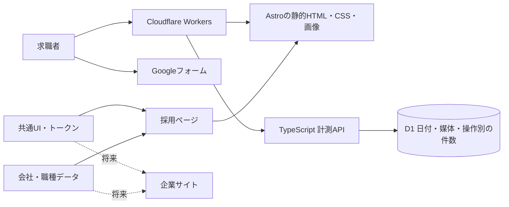

# 設計とデザインの判断

## 採用から全体刷新へ

2026-09-06の依頼に合わせ、実装基盤はCloudflare／TypeScriptとします。2026-09-07に採用サイトの公開先を `https://recruit.okinawakaigo.com/` に指定し、完成まではCloudflare Accessのメール認証とnoindexで限定公開する方針になりました。過去の納品物のサブドメイン・Pages・Apps Script案より、今回の依頼を優先しました。過去の契約書や議事録は履歴として変更していません。

採用だけを独立したビジュアルにせず、「利用者の暮らしと働く人の暮らし、どちらも大切にする」を共通のブランド方針とします。採用の主導線は説明会・見学相談。過去の議事録にある30〜40代のフルタイム人材を主に想定しつつ、年齢による応募制限は表現しません。

## 実装構成

Astroを採用した理由は、文章・写真が主体のページを静的HTMLとして届けられるためです。メニューやフォームへの引き継ぎだけをTypeScriptで動かし、職種とFAQの開閉には標準のdetails要素を使用します。Reactのクライアントランタイムは不要です。

Cloudflare Workers Static Assetsは静的ファイルとAPIを一緒に配信できます。通常のファイル配信はStatic Assets、`/api/*`だけWorkerを先に実行します。バックエンドは小さなFetchハンドラーで開始し、認証付きの業務サービスが必要になった時点で個別のWorkerを追加します。

共通化は、実際に再利用する `ui` と `content` に限定。Turborepoや空のサービス、認証、CMSは初版には導入しません。pnpm workspaceで独立したアプリを追加でき、必要になればビルドキャッシュも追加できます。

スタイルにはTailwind CSS 4のViteプラグインを使用します。色・書体・文字サイズ・4px単位の余白・ブレークポイントを `packages/ui/src/tokens.css` に定義し、全ページと共通UIが同じテーマを参照します。ボタンと選択欄を共有し、Stylelintで値の直接指定を検査します。具体的な使い分けと写真配置の例外は [スタイルの統一ルール](styling.md) を参照してください。

## デザイン方針

| 要素 | 方針 |
| --- | --- |
| 色 | 深緑 `#136c60`、文字 `#203e3a`、白 `#ffffff`、葉の陰 `#edf5f1`、砂 `#f6f6f0`、陽だまり `#ecda8a` |
| 書体 | 大見出しはNoto Serif JP 500、本文とUIはNoto Sans JP、英字・電話番号はDM Sans。いずれも自己配信 |
| 配置 | 見出し・本文は左揃え。ヒーローは言葉と人の写真の2列、スマホは縦積み。募集職種は一覧性のある開閉式 |
| 写真 | ヒーローは当初の大きな写真1枚と角丸。PCはコピーと縦長写真の2列、スマホは縦積み。会社の雰囲気は本文各所の写真でも伝える方針。沖縄の風景は地域とのつながりとして使用 |
| 操作 | CTAは深緑。角丸6px、基本高さ56px。本文を自動で隠すスクロール演出やスライドショーは使用しない |
| 言葉 | 働き方を保証する断言、架空の職員の声、未確認の給与・実績数値を載せない |

よくある福祉サイトの均等なカード群にせず、仕事は比較しやすい一覧、環境は3つの取り組み、相談は1つのパネルに役割を分けました。沖縄の観光だけが主役にならないよう、ヒーローには介護の場面を置いています。

ヒーローは静止画1枚を優先して読み込み、端末幅に応じたWebPを配信します。現在は当初の `care.jpg` をイメージ写真と明示して使用。実写を受領したら主写真を差し替え、本文各所でも会社の雰囲気が伝わる配置を整えます。撮影参考画像と撮影意図は `apps/recruit/src/content/photography-brief.ts` にまとめ、`/photo-brief/` で確認できます。詳細は [photography-brief.md](photography-brief.md) を参照してください。

## 予約と計測

採用の受付はクライアント所有のGoogleフォームへ接続し、電話相談は受け付けません。個人情報を受け付ける自社応募DBは作りません。フォーム未設定時は「受付準備中」と表示し、入力・送信を無効にします。公開前にフォームを設定します。フォームは自動送信せず、希望職種・希望ステップを事前入力した入力画面を開きます。

計測は日付（日本時間）×媒体×掲載場所×操作の件数のみ。IP・Cookie・ユーザーID・自由入力のURLを保存しません。計測が失敗しても相談やフォームへの遷移は継続します。パラメータは同一ページ内の移動で維持し、ブラウザへの永続保存は行いません。プライバシーページなどを経由して戻る場合や再訪は追跡しません。

`page_view`、`reserve_view`、`form_open`を区別し、フォームを開いた回数を予約数に換算しません。厳密な人数計測やbot排除ではなく、経路別の傾向を比較する用途です。Originの検証は認証ではないため、外部からの偽装を完全には排除できません。

受付は最大512バイト・既知の項目のみ。単一キーで各Cloudflare拠点のリクエスト数を制限し、過剰な書き込みを抑えます。この制限は全世界共通の厳密な上限ではなく、混雑時には正当な計測も落ちる場合があります。計測データの公開読み出しAPIはありません。

## 全体刷新の進め方

1. 確認済みの職種別給与・勤務条件、実際の活動写真、説明会の受付方法を確定する。
2. `.com`で採用ページを公開し、既存2ドメインからの案内リンクを整える。
3. 企業サイトのサービス情報を整理し、`packages/ui`を使って同じ基盤へ追加する。
4. 既存URLの棚卸しと移行先の対応表を作り、必要な301リダイレクト・canonicalを設定する。旧サイトの検索評価の継承は新ドメインを用意するだけでは完了しない。
5. 予約管理や職員向けサービスは、権限・個人情報の範囲を決めたうえで別アプリとして追加する。

## 参照

- [AstroのCloudflare配信ガイド](https://docs.astro.build/en/guides/deploy/cloudflare/)
- [Cloudflare Workers Static Assets](https://developers.cloudflare.com/workers/static-assets/)
- [Cloudflare Rate Limiting](https://developers.cloudflare.com/workers/runtime-apis/bindings/rate-limit/)
- [移行元の採用サイト・Web刷新議事録](https://github.com/jnlmyz/junabel/blob/843fc0782b2f1a247ef83049458dfff7052cfd09/nursing/meetings/2026-08-17-採用サイト・Web刷新.md)
- [旧仕様・簡易計測設計書](../archive/legacy-2026-09-07/docs/spec/03_簡易計測設計書.md)
