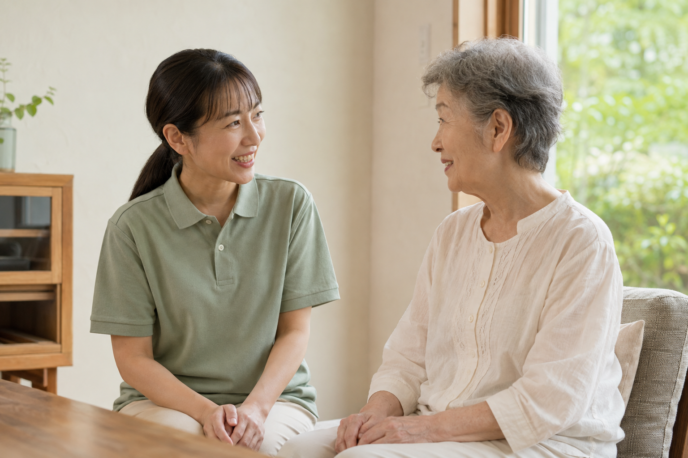
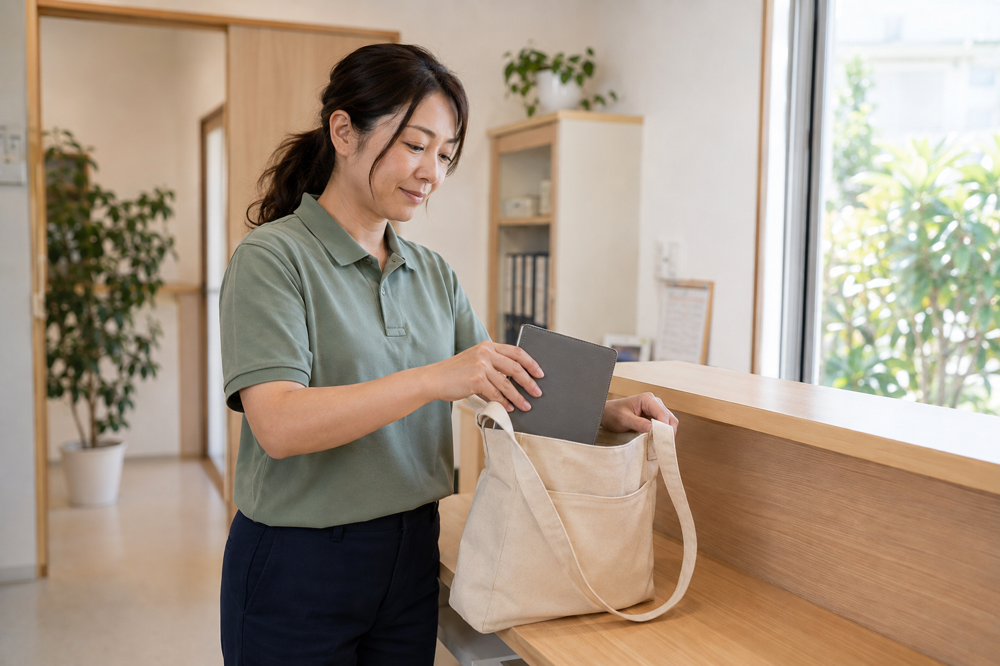

# 沖縄介護センター 採用ページ・撮影依頼メモ

作成日：2026-09-06。方針：ヒーローは大きな写真1枚、ページ全体で会社の雰囲気を伝える。

ヒーローは当初の1枚構成へ戻しました。[81webの事例研究と決定内容](design-research-81web.md)を踏まえ、撮影はページ全体で使う場面をそろえます。以下の3場面は参考で、使用枚数を3枚に限定するものではありません。

採用ページを読み進める中で、利用者さまへの向き合い方と、一緒に働く人の普段の姿を伝えます。「ここで働く自分」を想像できる、自然な表情と仕事のひとコマを撮影してください。

画像付きの閲覧版：開発サーバーの `/photo-brief/`。実際の掲載レイアウトは採用ページ `/` で確認できます。

## 掲載レイアウト

ヒーローはPCでは左に見出しと相談ボタン、右に大きな縦長写真1枚。スマートフォンは縦積みです。本文の写真は、実写素材に合わせて仕事・働く環境・職員紹介へ配置を詰めます。

| 撮影する場面 | 掲載候補 | 伝えたいこと | 構図 |
| --- | --- | --- | --- |
| 01 利用者さまと話す | 仕事紹介 | 相手を大切にする姿勢 | 横構図・寄りと引き |
| 02 同僚に相談する | 働く環境・ヒーロー | 一緒に働く人との距離感 | 縦横の構図・表情と空間 |
| 03 訪問前の準備 | 仕事紹介・日常 | 自分が働く姿を想像できる日常 | 横構図・顔と手元 |
| 職員本人のポートレート | 職員紹介・ヒーロー | 人柄と職場の第一印象 | 縦横の構図・自然な表情 |

ヒーローは縦長の切り抜きと大きな角丸に対応できるよう、顔と手元の周囲に余白を残してください。主写真は職員の自然な表情と職場の空間が分かる候補を複数撮影します。以下の参考画像はAI生成のダミーで、人物・室内・制服は架空です。年齢・性別・制服の色を再現する必要はありません。

## 01 利用者さまと、同じ目線で話す

職員と利用者役の2人が、同じ高さに座って会話する場面。相手の話に耳を傾ける、ふと笑みがこぼれる瞬間を撮ります。

- 腰から上の横構図。2人の顔を中央寄りに置き、頭の上・左右に余白を残す。
- カメラを見ず、相手を見る。手は膝や机に自然に置く。
- 柔らかな窓の光が入る、普段の暮らしに近い場所を選ぶ。
- キャプション案：「同じ目線で、想いを聞く。」

## 02 同僚と、気軽に相談する

同僚2人が、事務所で仕事について話す場面。声をかけやすい雰囲気と、話を聞く表情を撮ります。

- 2人の顔を近い高さにまとめ、表情が分かる寄りと、職場の空間が分かる引きの構図を撮る。
- ヒーロー候補として縦構図も残し、縦長に切り抜いても顔が切れない位置関係にする。
- 閉じた手帳や撮影用の資料を添え、普段のやりとりを再現する。
- キャプション案：「相談できる、仲間がいる。」

## 03 訪問前の、いつもの準備

手帳をバッグに入れる、持ち物を確かめるなど、実際の訪問前の準備から場面を選びます。

- 職員1人を頭から腰まで、斜め前から撮る。顔・手元・バッグを同時に見せる。
- 背景を広く取りすぎず、人物と動作を中央寄りにまとめる。
- 顔が下を向きすぎない瞬間を選ぶ。笑顔を作りすぎず自然な表情で。
- キャプション案：「今日の訪問へ、準備を整える。」

## 共通の撮影・納品条件

| 項目 | 依頼内容 |
| --- | --- |
| 光・色 | 柔らかな自然光、自然な肌の色。写真全体の明るさ・色温度をそろえる。強い美肌加工やオレンジのフィルターは使わない |
| 服・場所 | 普段の制服、事務所、道具を使用。実際の職員構成に合わせて出演者を選ぶ |
| 余白 | 頭上と左右に余白を残し、端で人物を切らない。ヒーローは縦長表示のため、縦横両方の構図を撮る |
| バリエーション | 各場面で少し引いた構図と少し寄った構図、表情違いを撮影。各3〜5候補を納品 |
| 画像 | 長辺3,000px以上、高画質JPEG、sRGB。文字・ロゴ・角丸を付けず、元構図のまま納品 |
| 掲載準備 | 出演者の掲載同意を確認。利用者さま役が必要なら協力者で再現する。資料・画面・名札は個人情報が映らないものを用意 |

Web向けの切り抜き・軽量化は実装側で行います。写真全体の色味を整えながら、表情・距離・場所に変化のある候補をそろえてください。

## 制作側の差し替え手順

1. 実写の元画像を `apps/recruit/src/assets/` に保存する。
2. `apps/recruit/src/pages/index.astro` のヒーロー画像importとalt・注記を、実際の内容に合わせて更新する。
3. 本文各所の内容に合う実写を選び、写真を配置する。撮影参考は `apps/recruit/src/content/photography-brief.ts` で管理する。
4. PC・スマートフォンで顔と手元の切れ、キャプション、画像容量を確認する。

生成ダミーの保存先は本メモの各画像リンク。正確な生成指示は [image-generation-prompts.md](image-generation-prompts.md) に記録しています。
